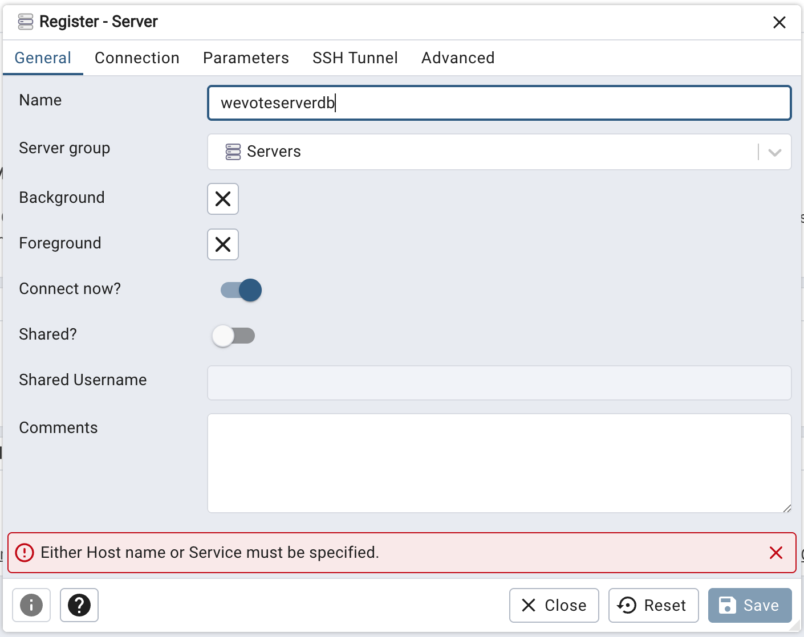
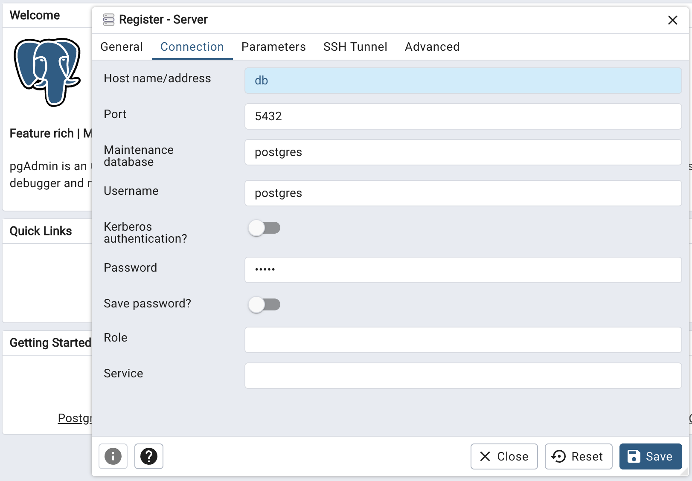
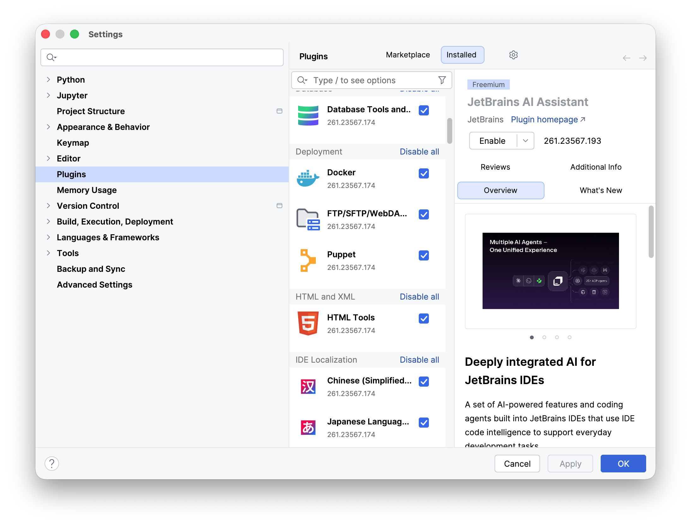
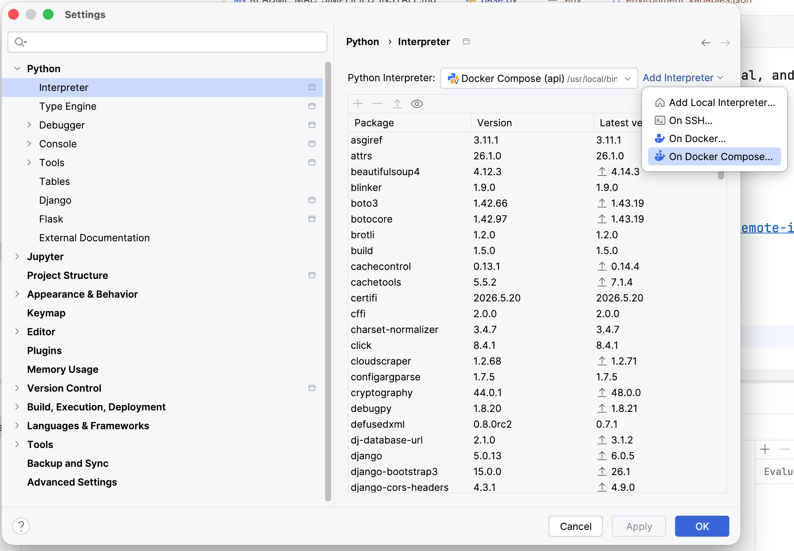
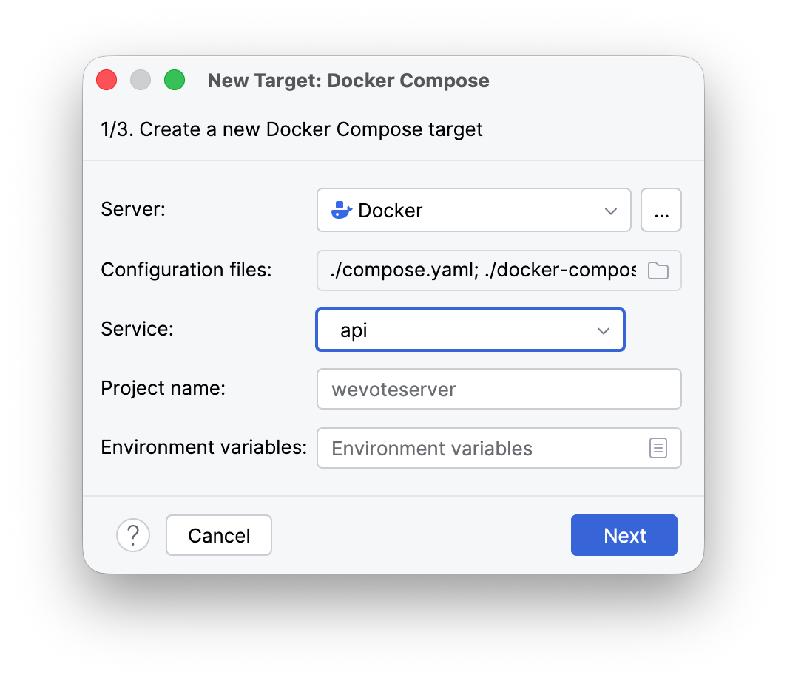
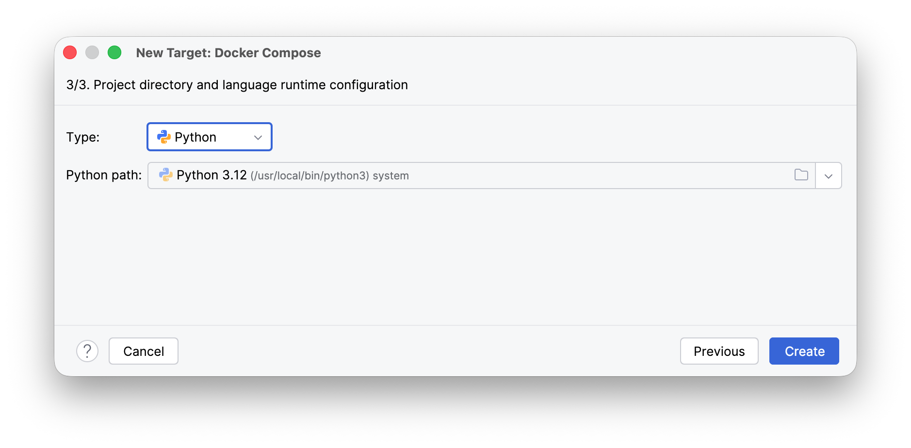
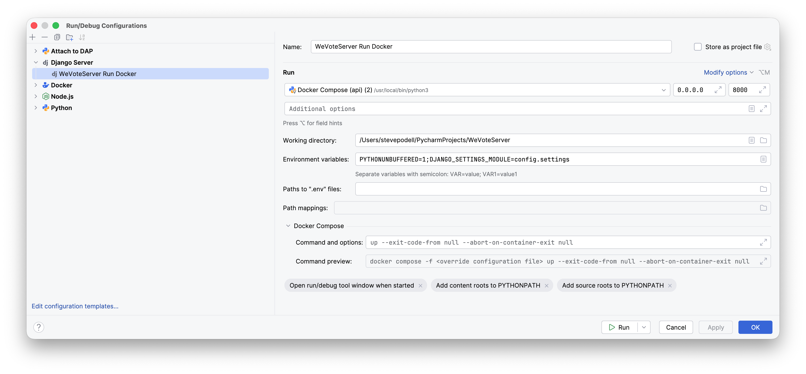
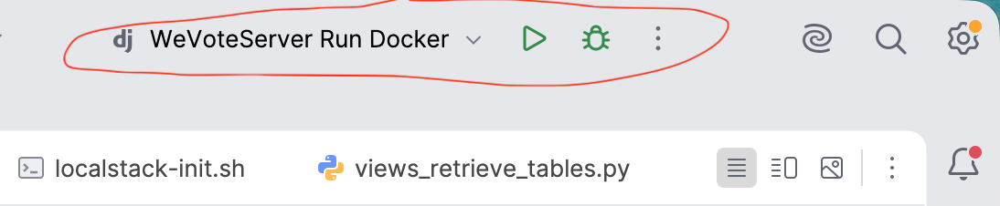
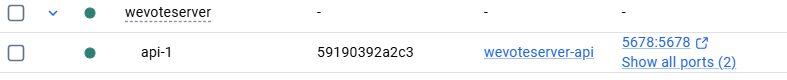
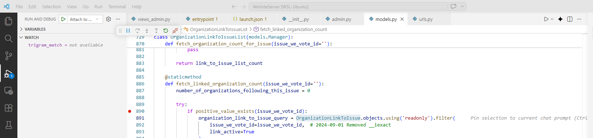

# README for Installation with Docker
[Back to root README](../README.md)

Only [Docker Desktop](https://docs.docker.com/get-docker/) is required.

[WSL 2](https://learn.microsoft.com/en-us/windows/wsl/compare-versions#comparing-wsl-1-and-wsl-2) users should follow [this guide](https://docs.docker.com/desktop/wsl/) as well.

## Installation

### 1. Clone your WeVoteServer fork (replace wevote with your github username)
There is need to do this step if you already have been working with the WeVoteServer.
  ```
  git clone https://github.com/wevote/WeVoteServer.git
  cd WeVoteServer
  ```

### 2. Create an environment file called `.env` to provide required settings. Example:
In the root directory (in the same directory as the requirements.txt file), create a new .env file with these values:

```
WE_VOTE_SERVER_PROTOCOL=https
DATABASE_USER=postgres
DATABASE_PASSWORD=admin
DATABASE_NAME=wevoteserverdb
DJANGO_SUPERUSER_EMAIL=anyone@wevoteeducation.org
DJANGO_SUPERUSER_PASSWORD=admin
```

### 3. Create Docker network
We will run all WeVote docker containers in an isolated docker network. Since the backend (WeVoteServer) and frontend (WebApp) both use docker compose (which typically manages docker networks for us), we must manually create this shared network to avoid conflicts. Even if you are not planning on running your own frontend, this step must still be completed.
```
docker network create wevote
```

### 4. Starting the containers

To start the WeVote API service and dependencies, use one of these commands. If you are just getting started, we recommend using the first (foreground) method below. These commands assume you are in the `WeVoteServer` folder created in Step 1 above.

#### 1. Start in the foreground (for debugging/logs):
```
docker compose up
```
This command builds, (re)creates, and starts all services, and aggregates their logs in your terminal. **Press `Ctrl+C` to stop the containers gracefully.**

#### 2. Start in the background (detached mode):
```
docker compose up -d
```
The `-d` (detached) flag runs containers in the background, leaving them running after you exit the terminal. Once started in detached state, use this command to stop the containers:
```
docker compose down
```

Once the containers are running, you can now access the API at [http://localhost:8000/](http://localhost:8000/)

### 5. Extra step to make changes to Docker startup files take effect

The `StatReloader` will automatically auto-reload changes into the Django `runsslserver` as you save them, except for these startup files:
```
   docker/Dockerfile.dev
   docker/dev/entrypoint
   compose.yaml
   config/environment_variables.json
   config/base.py
```
Most of the time you won't be changing these files, but if you do, you will need to run the following commands to add the changes into the Docker container.  
If you made a change, and you find that StatReloader doesn't auto-reload that change, you will also need to run these commands.
```sh
#Add the changes to the Docker container
docker compose build --no-cache

#Restart the Docker container
docker compose up
```

### 6. Remove containers and data (rarely needed)

**Do not run these commands as part of the installation steps, but if you need them they are documented here.**

The postgres database is stored persistently on your local computer outside the Docker container.  This allows the database, with the previous data, to be accessed in subsequent docker sessions.

To stop and remove all containers and saved data (including completely deleting the database and all its data), run the following command. Only do this if you want to completely remove your development environment or to start Docker's data over from scratch.  
```
docker compose down -v
```
You can also remove the wevote docker network:
```
docker network rm wevote
```

### Opening Shells

```sh
# Open a shell in the api container
docker compose exec api sh

# Open a shell in the db container (rarely needed, to run psql)
docker compose exec db sh
```

## PgAdmin
### 1. Access PgAdmin Container
Go to `localhost:8080` in your local web browser to access the `PgAdmin` container UI.  If you used all the default environment_variables: on PgAdmin login screen, your "Email Address/Username" will be `fake_email@wevoteeducation.org` and your password will be `admin`.
### 2. Register New Server
1. Right-click on 'Servers' in the left pane, and select Register/Server.

[//]: # ()

3. Server name is the `environment_variables.json` value for `DATABASE_NAME` (If you used all the default environment_variables and suggested .env file settings, the server name will be `wevoteserverdb`)



5. Set up the server connection (click the second tab 'Connection')
* Host name/address: `db` _(or the container name set here: https://github.com/wevote/WeVoteServer/blob/61ccbd45ba9c87960269ea65dc0e8eeca6f0bf03/compose.yaml#L4_)
* Port: `5432` 
* Maintenance database: `postgres`
* Username: `environment_variables.json` value for `DATABASE_USER` (The default value is 'postgres')
* Password: Whatever password was used when setup up your postgres superuser as in these instructions (The default value is 'admin'):

[//]: # (https://github.com/wevote/WeVoteServer/blob/develop/docs/README_API_INSTALL_POSTGRES_MAC.md)

[//]: # ()




6. **Only if pgadmin does not recognize your password for 'Register New Server'**, see the following section titled <ins>If 'Add New Server' does not accept the password for your postgres user</ins>, to do a password reset for the maintenance database user 'postgres'.

6. Click Save


### If 'Add New Server' does not accept the password for your postgres user

Open a terminal in the `db` container:

```sh
docker compose exec db sh
```

In the terminal
1. Enter the bash shell, by entering 'bash'
2. Start the PSQL command line app, by entering 'psql'
3. Enter the SQL command to change the password by entering `ALTER USER postgres WITH PASSWORD 'admin';`
4. Then exit PSQL by entering 'exit'


## Running your WeVoteServer in HTTPS mode

You can run your WeVoteServer in HTTP mode, and it will work perfectly well for many uses.  Some extra steps are required to run your server in HTTPS mode, which will
handle more use cases:
1. 'Sign in with Apple' will not redirect to localhost during OAUTH, same for Facebook.  
2. Both OAUTH services will not allow a redirect to localhost and both require HTTPS, so these changes are necessary for many testing scenarios.  
3. There are other external APIs that require HTTPS and a real commercial cert, but I forget which ones.

It is up to you, but HTTPS will allow you to avoid some edge case problems.  If you go forward with HTTP and you decided a later point you want HTTPS, these changes can be made at any time.

### First step toward running in HTTPS:  Make a small necessary change to your /etc/hosts

To make the change:

Make a second alias for 127.0.0.1 with this domain: `wevotedeveloper.com`

Explanation from the python-social-auth docs: "[If you define a redirect URL in an OAuth setup page, be sure to use http, or localhost because it won’t work](https://python-social-auth.readthedocs.io/en/latest/backends/facebook.html)"

First we have to make a small change to /etc/hosts.  This is the before:
```
    WeVoteServer % cat /etc/hosts
    ##
    # Host Database
    #
    # localhost is used to configure the loopback interface
    # when the system is booting.  Do not change this entry.
    ##
    127.0.0.1       localhost
    255.255.255.255 broadcasthost
    ::1             localhost
    WeVoteServer % 
```
Add a local domain alias `wevotedeveloper.com` for the OAuth Redirect URIs. 
To do this you need to add `wevotedeveloper.com` to your `127.0.0.1` line in /etc/hosts.  After the change:
```
    WeVoteServer % cat /etc/hosts
    ##
    # Host Database
    #
    # localhost is used to configure the loopback interface
    # when the system is booting.  Do not change this entry.
    ##
    127.0.0.1       localhost wevotedeveloper.com
    255.255.255.255 broadcasthost
    ::1             localhost
    WeVoteServer % 
```

To open etc/hosts Linux/macOS: you will need to elevate your privileges with sudo to make this edit to this system file ... ` % sudo vi /etc/hosts` You can do with any editor that you would prefer, as long as it can be run with sudo.

To open etc/hosts in Windows: 

1. Open the Start menu.
2. In the Run box, type Notepad.exe and right-click on Notepad, so that you can Run as administrator.  Do not press Enter here, or you won't have sufficient privileges to edit this system file.
3. In Notepad, select File then Open.
4. Navigate to C:\Windows\System32\drivers\etc
5. Change the file type to open from Text Documents (*.txt) to All Files (*.*).
6. Open the hosts file.

### Install the SSL Certificates
We have real commercial SSL certs from 'Sectigo' for wevotedeveloper.com

You can download them from https://drive.google.com/drive/folders/1q0KB2B8HB-AGTMLXrYq7x96McaEJ9_od?usp=drive_link

If you don't have access to this drive, talk to you team leader.

The two files are `wevotedeveloper.com_key.txt` and `wevotedeveloper.com.crt`

Copy them to your cert directory for example ... `WeVoteServer/cert/wevotedeveloper.com_key.txt`

### Changes to your environment_variables.json file
If you are setting up SSL, you probably will be doing the same for the WebApp, so make the both of the following changes to `environment_variables.json`.

In the first section of `environment_variables.json`, change the value of `WE_VOTE_SERVER_PROTOCOL` from http to https.  
You are probably going to set up the WebApp to run in https also, so change the value of `WEB_APP_ROOT_URL` to `https://wevotedeveloper.com:3000`

After these changes the file should look like this:
```
  "_comment":                       "Set WE_VOTE_SERVER_PROTOCOL to http or https, always http for production",
  "WE_VOTE_SERVER_PROTOCOL":        "https",
  "WE_VOTE_SERVER_DOMAIN_HTTP":     "localhost",
  "WE_VOTE_SERVER_DOMAIN_HTTPS":    "wevotedeveloper.com",
  "_comment":                       "Note that WE_VOTE_SERVER_PORT can be undefined if not needed",
  "WE_VOTE_SERVER_PORT":            "8000",

  "WEB_APP_ROOT_URL":               "https://wevotedeveloper.com:3000",
  "CAMPAIGNS_ROOT_URL":             "http://localhost:3000",
  "CHALLENGES_ROOT_URL":            "http://localhost:3000",
```

### Changes to your .env file
In your root .env file change
```
WE_VOTE_SERVER_PROTOCOL=http
```
to
```
WE_VOTE_SERVER_PROTOCOL=https
```

### Final steps for Docker (for both http and https setups)

Add the changes to the Docker container
```
   docker compose build --no-cache
```
Restart the Docker container
```
   docker compose up
```

## Import some ballot data from the live production API Server

From the startup page at 'http://localhost:8000/apis/v1/docs/' or 'https://wevotedeveloper.com:8000/apis/v1/docs/' , click the `admin tools.` link.

`Sign with email` in to the local admin page with your default user (probably 'samuel@adams.com' and password 'ale')

If you get a  `Your account doesn't have access to this page.` notice -- you can safely ignore this, it is due to a very old issue.

Click on the WeVote icon on the top to take you to the 'We Vote Admin Menu', scroll down and click `Fast Load (or Sync) Data with Master We Vote Servers`

Now you will get a 'Retrieve Fast Load Authentication' -- You must use the credentials that you use to access `https://api.wevoteusa.org` -- 
this allows you to download the developer data set for your local postgres server.  (These credentials are NOT `samuel@adams.com/ale`). 

You should see the "You are authenticated" indicator in green.  Then press the `FAST LOAD ALL THE ELECTION DATA, TO YOUR LOCAL POSTGRES` button.  You will see on screen progress as the 
tables are loaded, this takes about 30 minutes to complete on a fast Mac with a fast internet connection.  It will be slower if you are using a virtual machine.

That's it!

## Running and Debugging in PyCharm

### You need to get PyCharm Pro to order to run Docker from PyCharm

But you don't have to pay for it!  Start with the free trial, and ask someone on your team how to get the free license that is available for students and non-profit developers.

Download PyCharm Pro at https://www.jetbrains.com/pycharm/

### Configure a PyCharm interpreter using Docker

These are JetBrains' instructions in case something goes wrong with the following steps:
https://www.jetbrains.com/help/pycharm/using-docker-compose-as-a-remote-interpreter.html

You don't need a virtual environment (even though the JetBrains instructions say to do it, because Docker itself is a virtual environment.)

1) In Settings/Plugins
Make sure the Docker plugin is installed and enabled.



3) In Settings/Python/Interpreter
Press 'Add Interpreter' and select 'On Docker Compose...'



3) Then on the "New Target: Docker Compose" page one, set the service to 'api', and press 'Next'



5) Then on the "New Target: Docker Compose" page two, wait for it to do its magic, and when the spinning icon disappears, press 'Next'.
6) Then on the "New Target: Docker Compose" page three, the "Type" is "Python" -- select the highest version of Python you have installed from the list.  I'm not sure how important the Python version is, since the Docker contains its own Python from this project's configured Docker image.



7) Then press 'Create', to save the Docker Compose Python Interpreter.

### Create a Django Server Run configuration



* The Name can be "WeVoterServer Run Docker", or anything else you would like.
* The Run (Interpreter) field should be pre-populated with the 'Docker Compose (API)' Python interpreter that you just set up.
* The (unlabeled) host field must be '0.0.0.0' (localhost will not work here).
* The (unlabeled) port field must be '8000'
* The 'Working directory' should be your project root directory, something like '/Users/stevepodell/PycharmProjects/WeVoteServer'
* The Environment Variables field must contain "PYTHONUNBUFFERED=1;DJANGO_SETTINGS_MODULE=config.settings"
* All other fields can be left with their default values.
Press Apply to save the changes, and OK to close the dialog.

You should now be able to run and debug using PyCharm. If you already are a PyCharm user, this new run config should allow you to work just the same way you did before changing to Docker.
Press the green run icon to run, or the green bug icon to debug:




## Running and Debugging the docker image with VS Code 

[//]: # (**Prerequisite**)
[//]: # (* debugpy must be installed in the Docker container. Comment out note: This is not installed automatically in docker/dev/entrypoint and does not require the developer to do anything)
[//]: # (* Port 5678 must be exposed and accessible so that VS Code can attach to the debugger.  Comment out note:  This is standard in compose.yaml and does not require the developer to do anything)

Add the following configuration to your .vscode/launch.json file in **WevoteServer** repository:
```{
  "version": "0.2.0",
  "configurations": [
       {
      "name": "Attach to Docker",
      "type": "python",
      "request": "attach",
      "connect": {
        "host": "localhost",
        "port": 5678
      },
      "pathMappings": [
        {
          "localRoot": "${workspaceFolder}",
          "remoteRoot": "/wevote/code"
        }
      ],
      "justMyCode": false,
      "django": true
    }
  ]
}
```
**Note:** If the .vscode/launch.json file does not exist, create the .vscode directory and the launch.json file, then add the configuration shown above.



**Attaching the Debugger**
- Open the project in VS Code.
- Navigate to Run and Debug from the left-hand sidebar.
- From the debug configuration dropdown, select Attach to Docker.
- Click Start Debugging (or press F5) to attach VS Code to the Docker container.
- Set breakpoints in the desired source files.
- Trigger the application flow or API request you want to debug. Execution will pause at the configured breakpoints, allowing you to inspect variables, evaluate expressions, and step through the code.



## Resources

1. Docker Compose
    
    - [CLI](https://docs.docker.com/compose/reference/)

    - [Networking](https://docs.docker.com/compose/networking/)

2. PostgreSQL

    - [Official Docker Image](https://hub.docker.com/_/postgres)

[Back to root README](../README.md)
