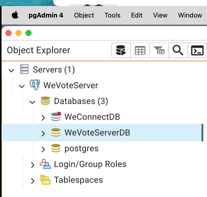

# README for Simplified Installation with PyCharm on a Mac
[Back to root README](../README.md)


**Caveat:  Operating Systems, IDEs, tools, packages, dependencies, and languages are constantly changing.**
We do our best to keep this procedure current with the external changes.  Tell us if you run into troubles.

## Installing WeVoteServer: On a new Mac
These instructions are for a new Mac, or at least a Mac that hasn't been used for 
Python development before.  Some of these tools may already be setup on your Mac, but
reinstalling them causes no harm, skip the parts you are sure you already have.

If you have never installed Postgres on your Mac (or don't mind fully deleting any Postgres that you have already 
installed on your Mac), follow these instructions.  They should take an hour or so to complete. 

1. Install the Chrome browser for Mac

2. Open the Mac "App Store" app, and download the current version of Apple's Xcode, which includes "c" language compilers 
    and native git integration. This download also includes Apple's Xcode IDE for macOS and iOS native development.

    **Note: Xcode requires about 13 GB of disk space, if you don't have much that room on your Mac, it is sufficient 
    to download only the "Xcode Command Line Tools".  Unfortunately you need to sign up as an Apple developer to do that.
    Download (the latest version of) "Command Line Tools for Xcode 13" at 
    [https://developer.apple.com/download/more/](https://developer.apple.com/download/more/).  These tools only require 185 MB 
    of disk space.  If you choose to download only the tools, skip on to Step 6.**
    
    If you have enough disk space, it is much easier to just install all of Xcode (including the full Xcode IDE) from 
    the app store:
     

3. Start xcode (you can find it with Spotlight, or in the Application folder)

     


4. July 2022, this step happens without a prompt:  When prompted, download the "Additional Components" (the Command Line Tools).  This takes many minutes to complete.

5. When you get to "Welcome to Xcode", quit out of the app. (For the WeVoteServer, we only need the command line tools that 
come with Xcode.)

    

6. Navigate in Chrome to [GitHub](https://GitHub.com).  Create a personal account if you don't already have one.
 
7. Within the GitHub site, navigate to [https://GitHub.com/wevote/WeVoteServer](https://GitHub.com/wevote/WeVoteServer). 
    Create a fork of wevote/WeVoteServer.git by selecting the "Fork" button (in the upper right of screen).
    
    


8. Download and install the Community version of PyCharm, it's free!  (If you are a student, you can get PyCharem Professional for free.  Professional is nice, but not necessary.)
    [https://www.jetbrains.com/pycharm/download/#section=mac](https://www.jetbrains.com/pycharm/download/#section=mac)

9. StartPyCharm, and press the 'Get from VCS' button.

    

10. Clone your fork of the git repository, by copying the URL to the repository into the URL filed, then press the Clone button.
_What this means in english is that you have created a copy in GitHub of the WeVoteServer codebase, and cloning it downloads
a copy of your copy to your Mac.  At this instant, the 'develop' branch of wevote/WeVoteServer matches
    your branch (in this example) SailingSteve/WeVoteServer and also matches the code on your Mac.

    

11. The PyCharm IDE appears in 'Dracula' mode, with the repository loaded to your disk, and ready to edit.

     

12. If you like 'Dracula' mode, you can skip this step.  Open PyCharm/Settings and press the
'Sync with OS' button to match the display mode of your Mac.  
   
     
     


13. In PyCharm/Settings/Plugins enable the IdeaVim tool (this takes a while).  
Feel free to add any other PyCharm tools that you would like!  When done press 'Ok', and the IDE will reboot.

     

14.  If you are using one of the newer Macs with Apple Silicon processor, the installer offers the "Apple Silicon Version" which is better and more stable -- take it if it is offered!

15. If the Apple top menu, shows "Git" skip this step.  If it says "VCS", the follow this step to configure Git

     
   
    Select 'Git' on the VCS meu, and press Ok.
   
     

16. In PyCharm set your git remotes. Navigate to the Git/'Manage Remotes...' dialog  (July 2022:  these two images might be reversed! (Verify!) But the results in the next step are corect.)

    

    The WeVoteServer project defines upstream and origin differently than most projects.

    Click the edit (pencil) icon, and change the word origin to upstream. This is how it looks after the change.
   
    

17. Then add a remote for your private branch by pressing the '+' button on the Git Remotes dialog.  Add the url for your
     fork of the WeVoteServer project origin (copy the url from the GitHub website). In this example, the developer 
     is "SailingSteve".
    
    
18. When the cloning is complete, it will look something like this.
    
     
    
     Press Ok to close the dialog

19. In PyCharm copy `environment_variables-template.json` to `environment_variables.json`

     

     Right click on `environment_variables-template.json` and select 'Copy', then right click paste on the `config` 
     directory and select 'Paste' in the pop-up, and then in the copy dialog that open up, and change the "new name:" to 
     `environment_variables.json`
    
     If you skip this step, in a much later step, when you run "makemigrations", it will fail with an 
     'Unable to set the **** variable from "os.environ" or JSON file' error.
    
     **There are a number of secret values in `environment_variables.json` that are not in source control,
     you will need to check in with Dale, as you find that you need them.**

20. In PyCharm, open the Terminal window and accept use of the z shell (if you want to use some other shell, feel free to skip this step).
   
     

     The terminal opens up with the project root directory set as the pwd (which is handy).

21. In the PyCharm terminal window download [Homebrew]( https://brew.sh/) ("the missing package manager for macOS") by entering
the following command:
    
     ``` 
     $ /bin/bash -c "$(curl -fsSL https://raw.GitHubusercontent.com/Homebrew/install/master/install.sh)"
     ``` 

     This loads and runs a Ruby script (Ruby comes pre-installed in macOS), and Ruby uses curl (also pre-loaded) to pull the file 
    into the bash (terminal) command shell for execution.  This Ruby script also internally uses 'sudo' which temporarily gives 
     the script root privileges to install software, so you will need to know an admin password for your Mac.  

     This script can take a few minutes to complete.

22. Install the latest version of Python

     ```
     $ brew install python@3.13
     ```
    (As of March 2025)  This should have installed Python 3.13.2 (or higher)
     If an older version of Python has been installed, and the installation fails, you may see an error
     
     In which case you run the suggested upgrade command, in this example it would be `brew upgrade python@3.13`, then finally export the path as shown below.
     ```
     $ export PATH="/usr/local/opt/python/libexec/bin:$PATH"
     ```
    
23. Create a new (or the first) virtual environment

   "PyCharm makes it possible to use the virtualenv tool to create a project-specific isolated virtual environment. The main purpose of virtual environments is to manage settings and dependencies of a particular project regardless of other Python projects. virtualenv tool comes bundled with PyCharm, so the user does not need to install it."

Follow the Pycharm instructions for creating a virtual environment, then come back to these instructions to finish your installation.

https://www.jetbrains.com/help/pycharm/creating-virtual-environment.html

24. Test that the newly installed Python is in the path.  Open a new terminal window in the
PyCharm IDE, and your new vitural environment should show in the beginning of the prompt.
```
(venv3.13.2) stevepodell@Steves-MBP-M1-Dec2021 WeVoteServer % python --version 
Python 3.13.2
(venv3.13.2) stevepodell@Steves-MBP-M1-Dec2021 WeVoteServer % 
```
25. If python --version fails,
    try 
    ```
    ln -s /opt/homebrew/bin/python3 /opt/homebrew/bin/python
    ```

26. Install OpenSSL, the pyopenssl and https clients:
 
     `(venv3.13.2) $ brew install openssl`
     If it is already installed, no worries!

27. Link libssl and libcrypto so that pip can find them. If this step fails you can continue with the rest of the installation:
     ```
     $ ln -s /usr/local/opt/openssl/lib/libcrypto.dylib /usr/local/lib/libcrypto.dylib
     $ ln -s /usr/local/opt/openssl/lib/libssl.dylib /usr/local/lib/libssl.dylib
     ```
30. Install libmagic. If this fails you can continue with the rest of the installation:

     `(venv3.13.2) $ brew install libmagic`

31. Install all the other Python packages required by the WeVoteServer project (there are a lot of them!)

     `(venv3.13.2) $ pip3 install -r requirements.txt`

     This is a big operation that loads a number of wheels definitions and then compiles them.   Wheels are
     linux/macOS binary libraries based on c language packages and compiled with gcc. 
     Wheels allow python library developers to speed up execution by coding critical or complex sections the c language.
     Interpreted Python code runs slower than compiled c. 

     **Note July 2022 if this fails due to `psycopg2-binary` requiring `pg_config` (which is installed with postgres), install Postgres first then come back and do the pip3 install -r requirements.txt` command.**
    
     If this installation succeeds with no missing libraries, or other compiler errors, we are
     almost done.  If this installation fails, you might need to comment out all lines in the requirements.txt file that have the comment `# recommend engine` on the end of the line, and then run the command above again.


<H2>Install and set up PostgreSQL and pgAdmin4</H2>

If you are sure that Postgres has not already been installed, and is not currently running on this Mac, you can skip
this step.  To see if postgres is already running, check with lsof in a terminal window `lsof -i -P | grep -i "listen" | grep postgres`:

    ```
    lsof -i -P | grep -i "listen" | grep postgres
    ```

    Results:
    ```
    postgres  13254 admin    5u  IPv6 0x35032d9cf207f247      0t0  TCP localhost:5432 (LISTEN)
    postgres  13254 admin    6u  IPv4 0x35032d9d01cd2647      0t0  TCP localhost:5432 (LISTEN)
    ```  
 
    If the output shows postgres has already been installed and is listening on port 5432.  Stop and fix this,  
    otherwise you would install a second postgres instance running on port 5433, and the result would be hours of "port 
    assignment" mess to clean up.

    ```
    brew services stop postgresql
    ```
   
    **If that lsof line returns nothing**, then you don't currently have postgres running, and you can continue on to the next step.

    or
   
    **If you don't mind fully deleting any Postgres database data that you have already installed**, then delete the existing Postgres now.  If you installed postgres with homebrew try `brew uninstall postgresql`, 
    but if that fails Postgres can be setup in many ways, so there are no detailed instructions here on how to delete Postgres (but. You can start with running `which postgres`
    in a terminal and going to that directory and deleting the instance or the symbolic links to the instance.  
    Next step is to reboot your Mac to see if Postgres starts up again.

    or

    **If you have to keep some data that is already stored in the Postgres instance on your Mac** that you absolutely need to 
    retain, then you will need to manually upgrade Postgres.  This is a ton of work, and is rarely necessary.
   

<H2>Install or update postgres</H2>

Most developers install postgres using Homebrew, if you installed it some other way, there may be some things to figure out... :pensive:

We need to get PostgreSQL (postgres) and pgAdmin 4 installed.

Possible steps:
 * [If you know you have postgres installed, and it is running, and you have pgAdmin running:](#if-you-know-you-have-postgres-installed-and-it-is-running-and-you-have-pgadmin-running)
 * [If you are unsure if postgres is installed:](#if-you-are-unsure-if-postgres-is-installed)
 * [If you have never installed Postgres for any other project, including school projects:](#if-you-have-never-installed-postgres-for-any-other-project-including-school-projects)
 * [If you need to install pgAdmin4 a Mac based browser app for the postgres database:](#if-you-need-to-install-pgadmin4-a-mac-based-browser-app-for-the-postgres-database)


### If you know you have postgres installed and it is running, and you have pgAdmin running

Within pgAdmin 4, under the server that you have running (which will probably be named WeVoterServer if you worked on other WeVote projects)...

1) On the left hand 'Servers' Right Click on Databases
2) On the right-click menu, select 'Create'
3) In the 'Database...' field, enter "WeVoteServerDB"

That's it, you are ready to continue on setting up the WeVoteServer

This picture shows the WeVoteServer in Postgres that was previously setup for the WeConnectDB (Node API Server, weconnect-server), 
with an additional database that you just created for WeVoteServerDB.  (No problem at all, if you don't have a WeConnectDB)

<br>


Next step: [Initialize empty tables in the WeVoteServerDB:](#initialize-empty-tables-in-the-wevoteserverdb)


### If you are unsure if postgres is installed

1) Determine if postgres is installed by entering `which postgres` in a terminal window (at the bottom of Webstorm)  
if you see a path to postgres, it is installed (and hopefully you will see homebrew in that path -- which makes things easier)

<br>

This command line result shows that postgres has been installed by homebrew, if no path to postgres is displayed, then postgres has not been previously installed

If postgres is installed, determine if it is already running with the macOS command 'pgrep -l postgres'

```
stevepodell@Steves-MBP-M1-Dec2021 WeVoteServer % pgrep -l postgres
2472 postgres
2474 postgres
...
43971 postgres
43972 postgres
43973 postgres
43974 postgres
43977 postgres
stevepodell@Steves-MBP-M1-Dec2021 WeVoteServer % 
```

If you see a number of different macOS processes running, that means that postgres is running. 

If this is the case go back to [If you know you have postgres installed and it is running and you have pgAdmin running:](#if-you-know-you-have-postgres-installed-and-it-is-running-and-you-have-pgadmin-running)

If postgres is installed, but not running, in a terminal within WebStorm, start postgres running as a daemon service:
```
(venv3.13.2) stevepodell@Steves-MBP-M1-Dec2021 WeVoteServer %  brew services start postgresql@14
==> Successfully started `postgresql@14` (label: homebrew.mxcl.postgresql@14)
(venv3.13.2) stevepodell@Steves-MBP-M1-Dec2021 WeVoteServer % 
```

Next confirm that you have pgAdmin 4 installed.  In spotlight type 'pgAdmin 4.app' if you find it, start it up.
Otherwise, go to [If you need to install pgAdmin4 a Mac based browser app for the postgres database:](#if-you-need-to-install-pgadmin4-a-mac-based-browser-app-for-the-postgres-database)
After installing pgAdmin 4, go to [If you know you have postgres installed and it is running and you have pgAdmin running] and follow those directions.

### If you have never installed Postgres for any other project including school projects
Use home brew to install postgres Version 14, the point version does not matter.  It can take a few minutes for brew to complete.
```
(venv3.13.2) stevepodell@Steves-MBP-M1-Dec2021 WeVoteServer % brew install postgresql@14
... Homebrew logs a whole bunch of lines about updating formulas, fetching, downloading, and pouring formulae...
... then finally it logs ...
This formula has created a default database cluster with:
  initdb --locale=C -E UTF-8 /usr/local/var/postgresql@14

To start postgresql@14 now and restart at login:
  brew services start postgresql@14
Or, if you don't want/need a background service you can just run:
  /usr/local/opt/postgresql@14/bin/postgres -D /usr/local/var/postgresql@14
(venv3.13.2) stevepodell@Steves-MBP-M1-Dec2021 WeVoteServer % 
```
Those lines at the end provide useful information.  
* initdb was run to create a bare minimum database for postgres, so it can store privileges, logins, and other configuration info.
* if you want to run postgres as a daemon service (so it is always running in the background), you can use this command in 
  a webstorm terminal window <br />`brew services start postgresql@14`<br /> and then ever your Mac is running, postgres will then be running
  (If you want to stop it running as a background service just type <br />`brew services stop postgresql@14`)
* Alternatively, if you just want to be able to turn on postgres when you want it (and not have it run as a daemon service) use this command in a Webstorm terminal<br/>
  `/usr/local/opt/postgresql@14/bin/postgres -D /usr/local/var/postgresql@14` <br />and when you are done, press Ctrl+C in that terminal
  window to stop postgres.

Now start postgres running as a daemon service:
```
(venv3.13.2) stevepodell@Steves-MBP-M1-Dec2021 WeVoteServer %  brew services start postgresql@14
==> Successfully started `postgresql@14` (label: homebrew.mxcl.postgresql@14)
(venv3.13.2) stevepodell@Steves-MBP-M1-Dec2021 WeVoteServer % 
```

### If you need to install pgAdmin4 a Mac based browser app for the postgres database
Skip this step if pgAdmin 4 is already installed and configured!

```
(venv3.13.2) stevepodell@Steves-MBP-M1-Dec2021 WeVoteServer % brew install --cask pgadmin4
```
This will take a few minutes, when it completes launch the app from Launch Pad or Spotlight

Register the server as WeVoteServer


And in the Connection tab set the Host name as localhost — also add any easy to remember postgres Username and Password, then save


<br><br>

Your database is now registered with pgAdmin 4!

(If you already had Postgres installed, you will have other databases on the Databases list, this is not a problem, just continue
with this step to create a new one for the WeVoteServer.)

On the left pane "Object Explorer" right click on "Databases" and add the "WeVoteServerDB".  An empty "WeVoteServerDB" has been created.

## Initialize the table structures within the WeVoteServerDB 

1. Create an empty log file on your computer to match the one expected by the app as configured in the environment_variables.json file:

    ```
    (venv3.13.2) $ sudo mkdir /var/log/wevote/
    (venv3.13.2) $ sudo touch /var/log/wevote/wevoteserver.log
    (venv3.13.2) $ sudo chmod -R 0777 /var/log/wevote/
    ```

    As configured by default in our configuration code from GitHub, only errors get written to the log.
    Logging has five levels: CRITICAL, ERROR, INFO, WARN, DEBUG.
    It works as a hierarchy (i.e., INFO picks up all messages logged as INFO, ERROR and CRITICAL), and when adding logging 
    code we specify the level assigned to each message. You can change this to info items by changing the LOG_FILE_LEVEL variable 
    in the WeVoteServer/config/environment_variables.json file to "INFO".
    
    **Note:** Logging slows down Python app execution in production, so only use it for very important or very rarely used code or 
    code that is only used by the admin pages by developers.  You can also write your log files at the DEBUG level, and then they
    won't execute on the production server.

2. "Migrations are Django’s way of propagating changes you make to your software models into your local postgres database schema."
   Everytime you create a table, change a field name or description, you are changing the model, and those changes need to 
   be incorporated into the on-disk database schema.

   Run 'makemigrations' to gather all the schema information that is needed to initialize the WeVoteServer database:

    ```
    (venv3.13.2) $ python manage.py makemigrations
    (venv3.13.2) $ python manage.py makemigrations wevote_settings
    ```
     (January 28, 2019:  that second makemigrations for the wevote_settings table should not be necessary, but as of today, 
     it is necessary.  That second makemigrations line will be harmless, if it becomes unnecessary at some point.)
   
3. Run 'migrate'.  Django "migrate is responsible for applying and un-applying migrations."

    `(venv3.13.2) $ python manage.py migrate`
 
## Set up a PyCharm run configuration

1. Set up a run configuration (this will enable the green play button, and the green debug button on the top line)
   
   Click in the "Add Configuration..." field that is to the left of the play button.

    
    
   
   Press the '+' sign in the upper-left corner of the dialog.  

    

   Then select Python, and click 'Add new run configuration...'

    

   For "Script path", add the path 
   to your `manage.py` file that will be in your project root directory, and for "Parameters" add `runserver` as the command.  
   Then press "Ok".
   
    

1.  Run the app:  Press the triangular Run button on the top line of the ide.  Note that a run window opens at the bottom of the IDE,
    on the same line as the "Terminal" tab.
    As API calls arrive at the server, the http requests will be displayed in this runtime log.

    Python print commands, only send their output to this log.  Python logger commands send the output
    to both this runtime log, and the log file that we created a few steps back.  On the production servers in AWS, these 
    log lines can be searched using the AWS CloudWatch console (ask Dale for CloundWatch access if you need it.)

## Set up an admin account in your local WeVoteServer database

1a.  Now, create an account for yourself to login to the management pages of the WeVoteServer.

    At WeVote, we call end users "voters".  

    The usage is:  `python manage.py create_dev_user first_name last_name email password`

    ```
    (venv3.13.2) stevepodell@Steves-MBP-M1-Dec2021 WeVoteServer % python manage.py create_dev_user Samuel Adams samuel@adams.com ale
    Creating developer first name=Samuel, last name=Adams, email=samuel@adams.com, password =ale
    End of create_dev_user
    (venv3.13.2) stevepodell@Steves-MBP-M1-Dec2021 WeVoteServer % 
    ```
    This new "voter" will have all the rights that you (as a developer) need to log in to 
    [http://localhost:8000/admin/](http://localhost:8000/admin/).  Once logged in you can start synchronizing data (downloading ballot and issue 
     data from the master server in the cloud, to your local server).
    
1b. If you run into problems with this script, there is an alternate way to give your local account admin permissions. 

i.  Open the file `WeVoteServer/voter/controllers_voter_create.py` and edit the variables to your own information.

ii. Edit the default information in this file (first_name, last_name, etc.) to be personalized for yourself, with your own information:

```
first_name = "Samuel"
last_name = "Adams"
email = "samuel@adams.com"
password = "GoodAle1776"
```

iii. Set `allow_create` to True, so when you run the script, changes can be made to your local database.

```
allow_create = True
```

iv. Visit http://localhost:8000/voter/create_dev_user 
    or https://wevotedeveloper.com:8000/voter/create_dev_user Once you have visited
    that page, you should have a new admin account you can sign in with.

2.  Navigate to [http://localhost:8000/admin/](http://localhost:8000/admin/) and sign in with your new username/password.  (in the example above the user email is `samuel@adams.com` and the password is `ale`).    

3.  **Your local instance of the WeVoteServer is now setup and running** (although there is no election 
    data stored in your Postgres instance, for it to serve to clients at this point).

## Import some ballot data from the live production API Server


Make sure you have given yourself admin privileges. When you run the following command, enter your email address and a simple password. This admin account is only used in development.

    python manage.py createsuperuser
    
Find the "Sync Data with Master We Vote Servers" link, and click it: [http://localhost:8000/admin/sync_dashboard/](http://localhost:8000/admin/sync_dashboard/)

Start by clicking the `Fast Load Data From We Vote Master Servers` button.

The fast loading will take somewhere in the range of 40 to 80 minutes to complete.  It will copy 
about 30 tables from the Master database in AWS, to your local database, which will allow you to 
run the api server software locally.

**You are now done installing your local server**

The following step is optional, most developers will not need it.

[Back to root README](../README.md)

## Optional Step:  Running in SSL/https mode

You only need to do this if you are going to be working on Login with Facebook or Stripe Donations

### If you have not created a secure certificate to run WebApp on your Mac in SSL/HTTPS mode, do this first

Prior to starting the app in SSL, you need to get the SSL certificates that allow the server to run in 'https' mode.
We don't want to publish these certificates in our git repository, but you can get them from anyone on your team or from Dale.
The file names are `wevotedeveloper.com.crt` and `wevotedeveloper.com_key.txt` -- put them in the weconnect-server/cert directory.

[Installing Secure Certificate](https://github.com/wevote/WebApp/blob/develop/docs/working/SECURE_CERTIFICATE.md)

### Make a small necessary change to your /etc/hosts

Facebook will no longer redirect to localhost and it also won't redirect to a http link, so these changes are necessary.

Make a second alias for 127.0.0.1 with this made up (but standardized for We Vote developers) domain: `wevotedeveloper.com`

Explanation from the python-social-auth docs: "[If you define a redirect URL in Facebook setup page, be sure to not define http://127.0.0.1:8000 or http://localhost:8000 because it won’t work when testing. Instead I define http://wevotedeveloper.com and setup a mapping on /etc/hosts.](https://python-social-auth.readthedocs.io/en/latest/backends/facebook.html)"

First we have to make a small change to /etc/hosts.  This is the before:
```
    (venv3.13.2) stevepodell@StevesM1Dec2021 WeVoteServer % cat /etc/hosts
    ##
    # Host Database
    #
    # localhost is used to configure the loopback interface
    # when the system is booting.  Do not change this entry.
    ##
    127.0.0.1       localhost
    255.255.255.255 broadcasthost
    ::1             localhost
    (venv3.13.2) stevepodell@StevesM1Dec2021 WeVoteServer % 
```
Add a local domain alias `wevotedeveloper.com` for the [Facebook Valid OAuth Redirect URIs](https://developers.facebook.com/apps/1097389196952441/fb-login/settings/). 
To do this you need to add `wevotedeveloper.com` to your `127.0.0.1` line in /etc/hosts.  After the change:
```
    (venv3.13.2) stevepodell@StevesM1Dec2021 WeVoteServer % cat /etc/hosts
    ##
    # Host Database
    #
    # localhost is used to configure the loopback interface
    # when the system is booting.  Do not change this entry.
    ##
    127.0.0.1       localhost wevotedeveloper.com
    255.255.255.255 broadcasthost
    ::1             localhost
    (venv3.13.2) stevepodell@StevesM1Dec2021 WeVoteServer % 
```

You will need to elevate your privileges with sudo to make this edit to this linux system file ... ` % sudo vi /etc/hosts` You can do with any other editor that you would prefer, as long as it can be run with sudo.


### Server setup changes
In your environment_variables.json
replace all (6) urls that contain `http://localhost:8000/` (or 8001), with `https://wevotedeveloper.com:8000/`

(Explanation at https://github.com/teddziuba/django-sslserver)

Then start an SSL-enabled debug server:


or if you prefer the command line ...

```
  $ python manage.py runsslserver wevotedeveloper.com:8000
```

and access the API Server Python Management app on https://wevotedeveloper.com:8000

The first time you start up the [runsslserver](https://github.com/teddziuba/django-sslserver) the app may take a full minute to respond to the first request.

That's it!

You will also need to have your WebApp running in SSL mode, on https://wevotedeveloper.com:3000

## Fixing "NET::ERR_CERT_COMMON_NAME_INVALID" errors in the DevTools ERROR Console

Find one of those failing links in the Network, and click it, to open in a new tab, then follow the
same procedure that you would follow for any invalid certificate.   The details of how you do this
changes over time, but in general on the chrome error screen that you see, follow the links for
viewing the page anyways.  Once you have done that the problem will go away.


[Back to root README](../README.md)


-----------
     
[//]: # (## June 14, 2021, Changes that were necessary for macOS Big Sur)

[//]: # ()
[//]: # (**This is not list of sequential steps to complete a re-installation.  This list describes a few problems)

[//]: # (that occurred, what was done to work around them.**)

[//]: # ()
[//]: # (*  macOS BigSur &#40;11.3.1&#41; was complaining about Python 3.6.1, and the app would not work, so)

[//]: # (   I upgraded Python to the latest 3.9.1)

[//]: # (   )
[//]: # (    )

[//]: # ()
[//]: # (*  Uninstall Python &#40;which was previously installed with Homebrew&#41;)

[//]: # (   ```)

[//]: # (   &#40;venv&#41; stevepodell@Steves-MacBook-Pro-32GB-Oct-2109 pkgconfig % brew uninstall --ignore-dependencies python3)

[//]: # (   ```)

[//]: # (   )
[//]: # (*  Install the latest Python)

[//]: # (    ```)

[//]: # (    &#40;venv&#41; stevepodell@Steves-MacBook-Pro-32GB-Oct-2109 pkgconfig % brew install python3)

[//]: # (   ```)

[//]: # (   )
[//]: # (*  Brew &#40;re&#41;link the python)

[//]: # (    ```)

[//]: # (    stevepodell@Steves-MacBook-Pro-32GB-Oct-2109 ~ % brew link python@3.9)

[//]: # (    ```)

[//]: # ()
[//]: # (*  Needed link it again to clear warnings about overwriting other links)

[//]: # (    ```)

[//]: # (    stevepodell@Steves-MacBook-Pro-32GB-Oct-2109 ~ % brew link --overwrite python@3.9)

[//]: # (   ```)

[//]: # (*  In the PyCharm IDE UI)

[//]: # (    1&#41;  Navigate to PyCharm/Settings/'Project: WeVoteServer'/'Python Interpreter' and press the gear icon and set up)

[//]: # (    a path to 3.9)

[//]: # (    1&#41; On the 'Python Interpreter' summary pop-up select 'WeVoteServer 3.9' &#40;or the latest version you installed&#41;.)

[//]: # (       )
[//]: # (        )

[//]: # ()
[//]: # (    1&#41; Open a **new** terminal window in the IDE, and run `python --version` to double-check that it is using Python 3.9)

[//]: # ()
[//]: # (    1&#41; Close the older terminal windows, that will have confused paths to the older python versions.)

[//]: # ()
[//]: # (*  Get the latest requirements.txt from git.)

[//]: # ()
[//]: # (*  Install the latest setuptools)

[//]: # (   ```)

[//]: # (   &#40;venv&#41; stevepodell@Steves-MacBook-Pro-32GB-Oct-2109 WeVoteServer % pip3 install --upgrade setuptools   )

[//]: # (   ```)

[//]: # (   )
[//]: # (*  Try to install requirements.txt in the Pycharm terminal window)

[//]: # (    ```)

[//]: # (    &#40;venv&#41; stevepodell@Steves-MacBook-Pro-32GB-Oct-2109 WeVoteServer % pip3 install -r requirements.txt)

[//]: # (   ```)

[//]: # (   )
[//]: # (*  If the installation fails, run brew's doctor)

[//]: # (    ```)

[//]: # (    &#40;venv&#41; stevepodell@Steves-MacBook-Pro-32GB-Oct-2109 WeVoteServer % brew doctor)

[//]: # (   ```)

[//]: # (   )
[//]: # (*  brew cleanup)

[//]: # (    ```)

[//]: # (    &#40;venv&#41; stevepodell@Steves-MacBook-Pro-32GB-Oct-2109 WeVoteServer % brew cleanup)

[//]: # (   ```)

[//]: # (   )
[//]: # (*  I had an old String.h first in the path, and causing a `fatal error: 'cstddef' file not found` error in String.h)

[//]: # (   ```)

[//]: # (    &#40;venv&#41; mv /usr/local/include/String.h /usr/local/include/String.h.saveoff)

[//]: # (   ```)

[//]: # (   )
[//]: # (*  This final installation of requirements.txt worked)

[//]: # (    ```)

[//]: # (    &#40;venv&#41; stevepodell@Steves-MacBook-Pro-32GB-Oct-2109 WeVoteServer % pip3 install -r requirements.txt)

[//]: # (   ```)

[//]: # (   )
[//]: # (*  If problems appear with the openid package...)

[//]: # ()
[//]: # (    Look in External Libraries/site-packages and use 'pip uninstall' to remove any libraries with 'openid' in their)

[//]: # (    name, and then try 'pip3 install -r requirements.txt' to reload openid.)

[//]: # ()
[//]: # (*  'pip3 install -r requirements.txt' does not reload openid, try from the command line)

[//]: # ()
[//]: # (    Try these commands, one at a time, in this order:)

[//]: # (    ```)

[//]: # (    pip install -e git+git://GitHub.com/necaris/python3-openid.git@master#egg=openid)

[//]: # (    pip install -e git+git://GitHub.com/necaris/python3-openid.git@master#egg=python3-openid)

[//]: # (    ```)
   
-----------
     
## January 27, 2023, Saving of the new "Profile Image" while Testing Facebook Sign in 
In order to speed up signin with facebook, we removed the scaling and saving of the facebook profile image from in-line in 
to having them be executed in parallel so that the sign-in occurs much quicker for the voter.

Gunicorn, the application server that the Python API Server runs in production, does not handle threads well, so instead
we run them in a queue in a seperate process.  We use the AWS SQS queue manager to queue up the processing requests that potentially could be coming in from multiple 
Voters, and execute them in a full image of the WeVote API Server.

In order to run all these AWS features locally on your Mac, do the following:

1) Download the docker CLI from https://docs.docker.com/desktop/install/mac-install/
2) Find the downloaded file, and substitute your Downloads path into following set of commands
   ```
    (venv3.13.2) WeVoteServer % sudo hdiutil attach '/Users/stevepodell/Downloads/Docker (1).dmg'
    (venv3.13.2) WeVoteServer % sudo /Volumes/Docker/Docker.app/Contents/MacOS/install
    (venv3.13.2) WeVoteServer % sudo hdiutil detach /Volumes/Docker
   ```
3) MacOS modal dialog that appears, allow docker to make some symbolic links -- allow this.
4) Once the Docker Desktop starts, and shows as running, typing 'docker -v' at the command line, to confirm that the CLI portion is running
   ```
    (venv3.13.2) stevepodell@StevesM1Dec2021 tmp % docker -v
    Docker version 20.10.21, build baeda1f
    (venv3.13.2) stevepodell@StevesM1Dec2021 tmp % 
   ```
5) Check to see if awslocal is installed
    ```
   (venv3.13.2) stevepodell@StevesM1Dec2021 WeVoteServer % awslocal --version
    aws-cli/2.9.13 Python/3.11.4 Darwin/22.3.0 exe/x86_64 prompt/off
    (venv3.13.2) stevepodell@StevesM1Dec2021 WeVoteServer % 
   ```
6) if aws (awslocal) is not available at the command line, follow instructions at
   https://docs.aws.amazon.com/cli/latest/userguide/getting-started-install.html#getting-started-install-instructions
7) Check to see if you have localstack installed
    ```
    (venv3.13.2) stevepodell@StevesM1Dec2021 WeVoteServer % localstack --version
    1.3.1
    (venv3.13.2) stevepodell@StevesM1Dec2021 WeVoteServer % 
   ```
8) If you do not already have localstack installed
    ```
    pip install localstack localstack-client awscli-local
    ```
9) Start localstack
   ```
   localstack start -d
   ```
10) Wait for sqs service to launch   
11) Create a sqs queue, and copy the QueueUrl it reports to environment-variables.json
    ```
    awslocal sqs create-queue --queue-name job-queue.fifo --attributes FifoQueue=true,ContentBasedDeduplication=true
    ```
12) Make sure the QueueUrl displayed matches AWS_SQS_WEB_QUEUE_URL in the config file environment-variables.json
    It is likely to look like this...
    ```
    "AWS_SQS_WEB_QUEUE_URL":          "http://localhost:4566/000000000000/job-queue.fifo",
    ```
13) Then start the queue processing code (in a separate python server instance) by opening a terminal window and running
    ```
    python manage.py runsqsworker
    ```
14) You will see logging from the sqs worker in that terminal

Note that if you change any code, that would be needed in the instance of the API Server running under SQS, you will need to
kill the runsqsworker in the terminal window, and restart it.
